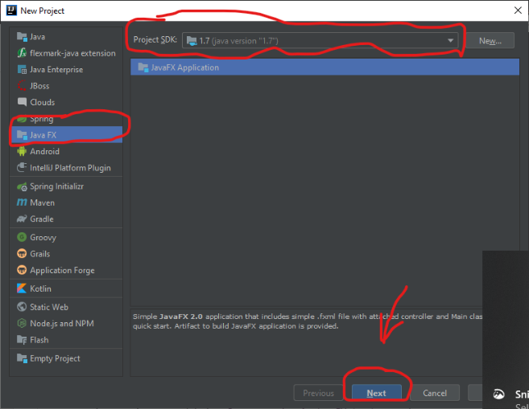
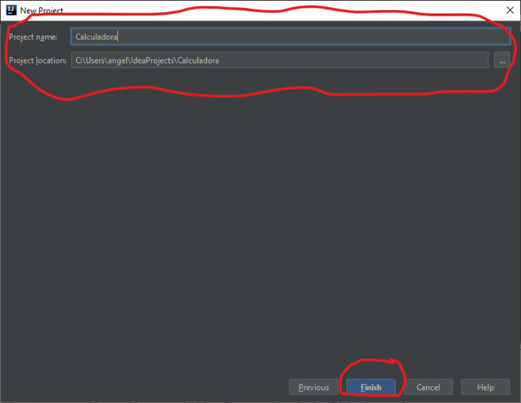
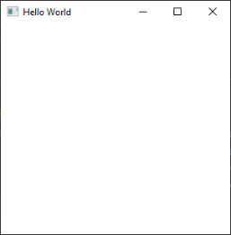

# Investigacion sobre JavaFX

## Contenido
1. [JavaFX](#java-fx)
   1. [Funcionamiento]()
   2. [Contexto]()
   3. [Sintaxis]()
2. [Java Swing](#java-swing)
   1. [Funcionamiento]()
   2. [Contexto]()
   3. [Sintaxis]()
3. [Diferencias entre JavaFX y Swing](#dif-fx-swing) 
4. [Calculadora cientifica en JavaFX](#cal-java-fx)
   1. [Explicacion del desarrollo]()
   2. [Resultados]()
5. [Entegrables](#entre)
   1.   [Reporte]()
   2. [Código]()
   
### JavaFX


### Java Swing


  
   

****
### Calculadora cientifica en JavaFX
A continuacion se presenta el proceso del desarrollo de la calculadora cientifica con JavaFX
#### Requisitos
Para poder crear aplicaciones con JavaFX es necesario contar con un JDK 7.80 o inferior, ya que las versiones recientes dejaron a Java FX fuera del paquete del JDK.
[(Pueden descargar aqui la version 7u80 del JDK de Java)](https://www.oracle.com/technetwork/java/javase/downloads/java-archive-downloads-javase7-521261.html)

(Opcionalmente)
Para lograr una buena experencia con el diseno de las interfaces en JavaFX, Oracle sigue poniendo a disposicion una herramienta libre llamada [JavaFX Scene Builder](https://www.oracle.com/technetwork/java/javase/downloads/javafxscenebuilder-info-2157684.html), que nos permite visualizar las interfaces disenadas con JavaFX, sin necesidad de codificar esas interfaces. 

#### Empezemos
Para iniciar, debemos de aclarar que cada IDE (NetBeans, IntelliJ, Eclipse, etc) tiene sus propias funcionalidades para crear plantillas para crear la base de una app JavaFX.

En este caso, para IntelliJ el procedimiento estara en este [link](https://www.jetbrains.com/help/idea/preparing-for-javafx-application-development.html).

Una vez que abran sus IDE favorita, deberan de crear un nuevo proyecto.
Tomen en cuenta que para crear una app JavaFX deberan de tener ya instalado una version que lo soporte (<= 7u18)  



Asignen un nombre al proyecto.



Una vez que ya allan hecho todos los pasos anteriores correctamente. La IDE les creara tres archivos necesarios para el dessarrollo de la app.

**sample.fxml**

```
<?xml version="1.0" encoding="UTF-8"?>
<?import javafx.geometry.Insets?>
<?import javafx.scene.layout.GridPane?>
<?import javafx.scene.control.Button?>
<?import javafx.scene.control.Label?>
<GridPane fx:controller="Controller"
          xmlns:fx="http://javafx.com/fxml" alignment="center" hgap="10" vgap="10">
</GridPane>
```  

**Controller.java**

```
public class Controller {

} 
```

**Calculadora.java** 
``` 
import javafx.application.Application;
import javafx.fxml.FXMLLoader;
import javafx.scene.Parent;
import javafx.scene.Scene;
import javafx.stage.Stage;

public class Calculadora extends Application {

    @Override
    public void start(Stage primaryStage) throws Exception{
        Parent root = FXMLLoader.load(getClass().getResource("sample.fxml"));
        primaryStage.setTitle("Hello World");
        primaryStage.setScene(new Scene(root, 300, 275));
        primaryStage.show();
    }


    public static void main(String[] args) {
        launch(args);
    }
}
```

Si compilamos y ejecutamos la aplicacion, el resultado seria algo asi.

